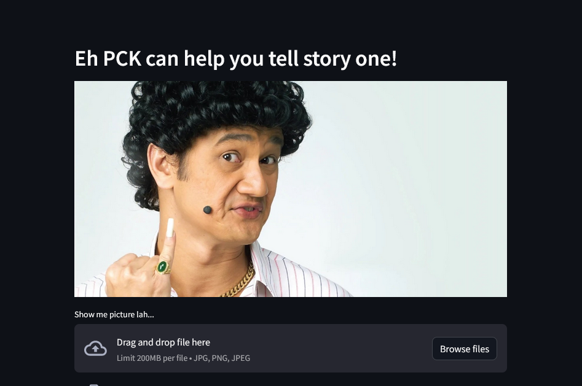

# Phua Chu Kang story generator
Fun project to generate Phua Chu Kang-styled stories from image using multi-modal models with the Hugging Face `transformers` library, and stitching it up with prompt templates using `langchain`. Also took the opportunity to make a very simple web app using `streamlit` to serve the model.

## Demo

## FAQ
1. Why?
    - Why not? 😊
2. Why Phua Chu Kang?
    - Why not? 😊
3. Do you store the images?
    - No, no images are persisted on the backend. The bytes from the image are directly passed for model inference.

## Credits
PCK image from [here](https://www.big3.sg/blog/singapore-cultural-icon-phua-chu-kang).
